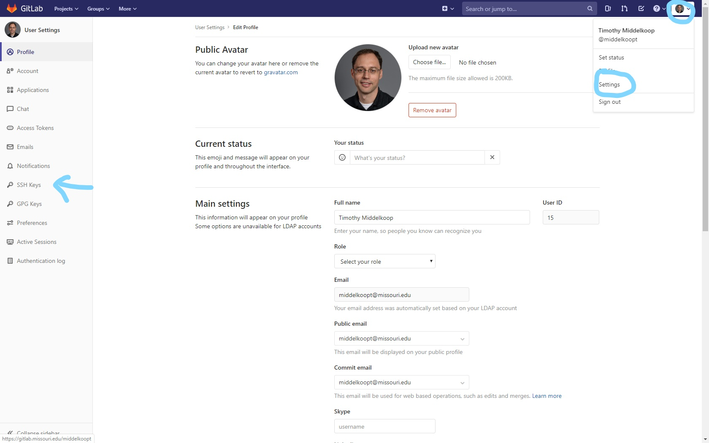
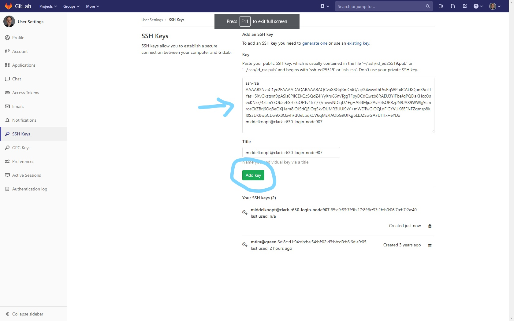
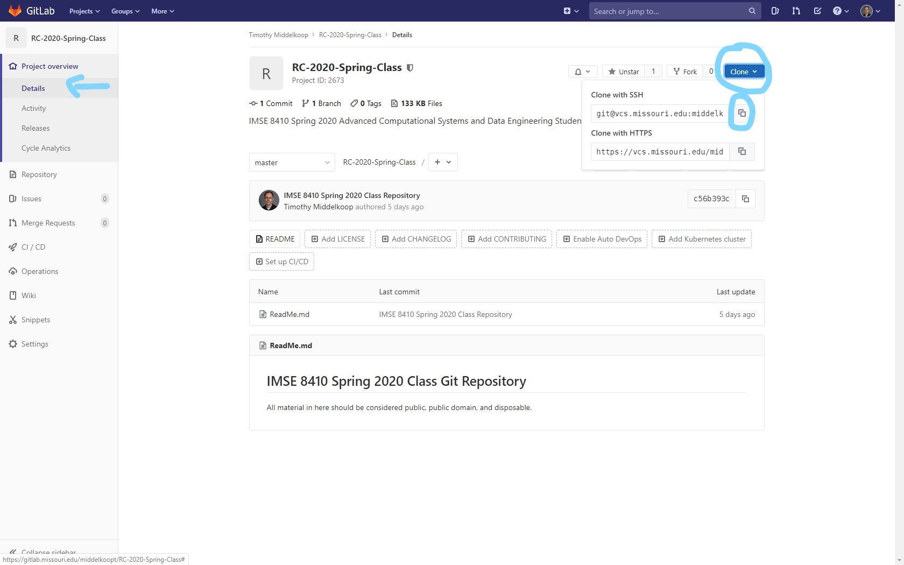

# IMSE 8410 Tools

*IMSE 8410 Advanced Computational Systems and Data Engineering*

Material Copyright 2017-2019 by Timothy Middelkoop. Source code
licensed under the Apache License, Version 2.0. Documentation licensed
under CC by SA 3.0.

## Tool Setup

This class is approached from two directions.  Concepts and Tools.  It
takes a tool-first approach not because they are more important, they
are only a means to an end, but because the technical constraints,
prerequisites, and the shear time it takes to absorb and use the tools
had to be carefully constructed.  The tools are used to apply concepts
and techniques.  We will always try to motivate and explain the "why"
of the tools but it takes active participation and thinking. The tools
are replaceable, the concepts and techniques endure.

### OnDemand

The first tool is a web interface to the Teaching Cluster (Clark) that
will be used throughout the class.  The web interface can be used for
the entire class but native ssh clients may be preferable (MobaXterm
for example in windows).  This interface provides a gateway to other
interactive and CLI services on Clark.  This list is always expanding
and please remember that this service is in Beta and to report any
issues that you may encounter.

Currently the Teaching Cluster provides the following via Open OnDemand:
 * A console (OnDemand) to manage interactive sessions with the cluster. https://openondemand.org/ 
 * A web based Secure Shell client to connect directly to the cluster. https://hterm.org/
 * Jupyter Lab and Jupyter Notebook environments for scientifc notebooks. https://jupyterlab.readthedocs.io/en/stable/
 * Web based RStudio Server for R. https://rstudio.com/products/rstudio/#rstudio-server
 * Web based Visual Studio Code IDE for advanced editing. https://github.com/Microsoft/vscode

To setup the OnDemand Jupyter Lab environment complete the steps
detailed in the following screenshots:

Navigate to https://ondemand.rnet.missouri.edu and Login.  `Click
Interactive Apps`.
 `Click
Jupyter
Lab`
 `Scroll
Down`
 `Change
Settings: Select 'Include Bash Kernel', 2 Hours, 2 Cores, 2 GB`; `Click
Launch`
 Wait
20 or more
minutes.  While waiting you may wish to setup the Clark Shell (CLI) environment detailed in the next section.
 `Connect
to
Jupyter`
 Jupyter
Lab


### Clark Shell (CLI)

A Command Line Interface (CLI), or terminal, is a way of interacting
with a system and dates back to the earliest of computing
machines. Commands are entered on a keyboard, the computer computes,
and the results are displayed. Although this method requires very low
bandwith to communicate to a machine, it provides the highest
"connection" with the machine.

A Secure Shell (ssh) session will be the primary way to access and
interact with the Clark Teaching Cluster during the semester and
should be used when ever possible.  Use of the OnDemand and Jupyter
Lab file management capabilities will only make it more difficult in
the long run to use the system.  We will now go over how to setup the
OnDemand.  There are detailed instructions below followed by a screen
capture of an example session.  Please be sure to replace login
information with your own.

To setup the Shell go to https://ondemand.rnet.missouri.edu and
navigate to `Clusters` > `_Clark Shell Access` or use the direct URL https://ondemand.rnet.missouri.edu/pun/sys/shell/ssh/clark.rnet.missouri.edu and complete the following:
 * If asked `Are you sure you want to continue connecting (yes/no)?`
   answer `yes` (just `y` will not work).
 * You should see a password prompt with your Pawprint in the beginning.
 ```
middelkoopt@clark.rnet.missouri.edu's password: 
 ```
 * Enter your University (Pawprint) password when prompted. 
   * You will not see anything while you type. If you do, stop. Something is wrong.
   * Press enter when you are done entering your password.
 * You should be greeted with the Message of the Day (MOTD) and a
 "Prompt". Your username should be seen just before the `@` followed
 by the name of the machine (hostname).
 ``` 
[middelkoopt@clark-r630-login-node907 ~]$
```

The setup of the shell is complete.  We will now generate a secure
shell key to allow for easier access to the system and to allow access
for other tools (GitLab).
 * Create a new *ssh key* by entering the command `ssh-keygen`
 * Press *enter* to accept the default location (`~/.ssh/id_rsa`)
 * Press *enter* to enter an empty pass phrase. (this is a machine key only)
 * Press *enter* to re-enter an empty pass phrase.
```
[middelkoopt@clark-r630-login-node907 ~]$ ssh-keygen
Generating public/private rsa key pair.
Enter file in which to save the key (/home/middelkoopt/.ssh/id_rsa):
Enter passphrase (empty for no passphrase):
Enter same passphrase again:
Your identification has been saved in /home/middelkoopt/.ssh/id_rsa.
Your public key has been saved in /home/middelkoopt/.ssh/id_rsa.pub.
The key fingerprint is:
SHA256:iZhVMCA+eDhljPMKa8pKJNlY3XbJjxAkwVr5FzFgEQg middelkoopt@clark-r630-login-node907
The key's randomart image is:
+---[RSA 2048]----+
| oEo+*X=+.       |
|o*.o=+ =.o       |
|+o=o..= +.       |
|.Bo. =.+.+       |
|=+. o ..S .      |
|=.               |
|+.               |
|o.               |
|o                |
+----[SHA256]-----+

```
Please note the "randomart" is *not* your ssh key.

We now need to allow access to Clark by OnDemand by adding the public key of the newly created key to the `.ssh/authorized_keys` file.
 * Copy the secure shell public key to the `authorized_keys` file in the `.ssh/` folder
 ```
cp -v .ssh/id_rsa.pub .ssh/authorized_keys
 ```
 * Secure the file by changing the permissions to be only readable and writable by your user.
 ```
chmod 600 .ssh/authorized_keys
 ```

The complete session:
```
[middelkoopt@clark-r630-login-node907 ~]$ cp -v .ssh/id_rsa.pub .ssh/authorized_keys
‘.ssh/id_rsa.pub’ -> ‘.ssh/authorized_keys’
[middelkoopt@clark-r630-login-node907 ~]$ chmod 600 .ssh/authorized_keys
[middelkoopt@clark-r630-login-node907 ~]$
```

A screen capture of the above directions can be seen below.

`Clusters > _Clark Shell Access`


### Gitlab

Gitlabs is a source code management and project management tool based
around the `git` (https://git-scm.com/) distributed version control
system.

We will login (on campus or using a VPN) to
https://gitlab.missouri.edu and allow access (via the secure shell key
generated in OnDemand) by you on Clark and clone (copy) the class repository.

Complete the following steps:
 * Login to https://gitlab.missouri.edu/
 * Setup your profile (click the `profile icon` on the top right and select `Settings`) or use https://gitlab.missouri.edu/profile
 * Setup your ssh keys (in settings click `ssh keys`) or use https://gitlab.missouri.edu/profile/keys
 * Login to Clark and copy your Clark machine public key (`~/.ssh/id_rsa.pub`) into the `Key` box on Gitlab.  The key starts with `ssh-rsa` and ends with the `@clark-r630-login-node907` hostname.  The steps are broken down as follows:
   * Run the command `cat ~/.ssh/id_rsa.pub`
```
[middelkoopt@clark-r630-login-node907 ~]$ cat .ssh/id_rsa.pub
ssh-rsa AAAAB3NzaC1yc2EAAAADAQABAAABAQCvaX8GqRmO4G/zc/34wwvthL5sBqWPu4CAkKQunK5oLtYas+5XvGkztsm9pASis8PlICEKQc3QdZ4lYyXru66nvTggTFpyDCdQwzb8RAEU3YlTbeJqPQDaKHccOsexKNxx/4zLmYkOb3eESHEkiQF1v4lr7i/7/mwwNDlqD7+g+AB3Mju2AvHBsQRRzjJN9JAX9WWljj9smrosCkZBrj6Oq3eOXj1am8jOJSdQElOqSkvDUMR3UUi9xY+mWDTwGiOQLqFlGYVUK6EFNFZgmsp8kI0SaDK8wpCDw9X8QxvhFdUeEpqkCV6qMz/IAObG9UfKgbLbJZSwGA7UHTx+eYDx middelkoopt@clark-r630-login-node907
[middelkoopt@clark-r630-login-node907 ~]$
``` 
   * Copy the key from the terminal, your key should look like the following:
```
ssh-rsa AAAAB3NzaC1yc2EAAAADAQABAAABAQCvaX8GqRmO4G/zc/34wwvthL5sBqWPu4CAkKQunK5oLtYas+5XvGkztsm9pASis8PlICEKQc3QdZ4lYyXru66nvTggTFpyDCdQwzb8RAEU3YlTbeJqPQDaKHccOsexKNxx/4zLmYkOb3eESHEkiQF1v4lr7i/7/mwwNDlqD7+g+AB3Mju2AvHBsQRRzjJN9JAX9WWljj9smrosCkZBrj6Oq3eOXj1am8jOJSdQElOqSkvDUMR3UUi9xY+mWDTwGiOQLqFlGYVUK6EFNFZgmsp8kI0SaDK8wpCDw9X8QxvhFdUeEpqkCV6qMz/IAObG9UfKgbLbJZSwGA7UHTx+eYDx middelkoopt@clark-r630-login-node907 
```
   * Paste it into the `Key` box on Gitlab.
   * Click `Add Key`

Screenshots are below:




### Git

Git is a distributed version control system and we will be using it
exclusively throughout the course to manage all work-products for the
assignments (mercerizes and assessments) and project.  We will be
using git primarily through the command line and use GitLabs for
project management aspects.  Read the "Pro Git" material assigned in
readings for more information and context.

#### Clone Git Repositories.

To get started we will setup a project space on Clark and "clone" the
class repository
(`git@gitlab.missouri.edu:middelkoopt/RC-2020-Spring`) on Clark from
GitLab (https://gitlab.missouri.edu).  This will use the key generated
and associated with your GitLab account in the previous sections.  To
complete this do the following (complete transcript follows):
 * Login to `clark.rnet.missouri.edu` via OnDemand
   (https://ondemand.rnet.missouri.edu) or another Secure Shell
   client.
 * Since this is a new environment create, if it does not already
   exist, a `projects` folder in the root of your home directory on clark with the following commands:
 ```
cd ~
mkdir projects
cd projects
pwd
 ```
 * Clone the course material repository and verify the contents (you may need to accept the host ssh key) with the following commands:
 ```
cd ~/projects
git clone git@gitlab.missouri.edu:middelkoopt/RC-2020-Spring 
cd RC-2020-Spring
ls -l
 ```
 * Clone the class repository, you must first request permission to access.
 ```
cd ~/projects
git clone git@gitlab.missouri.edu:middelkoopt/RC-2020-Spring-Class
cd RC-2020-Spring-Class
ls -l
 ```

The complete session transcript follows:
```
[middelkoopt@clark-r630-login-node907 ~]$ cd ~
[middelkoopt@clark-r630-login-node907 ~]$ mkdir projects
[middelkoopt@clark-r630-login-node907 ~]$ cd projects/
[middelkoopt@clark-r630-login-node907 projects]$ pwd
/home/middelkoopt/projects
[middelkoopt@clark-r630-login-node907 projects]$ cd ~/projects
[middelkoopt@clark-r630-login-node907 projects]$ git clone git@gitlab.missouri.edu:middelkoopt/RC-2020-Spring
Cloning into 'RC-2020-Spring'...
The authenticity of host 'gitlab.missouri.edu (128.206.56.2)' can't be established.
RSA key fingerprint is SHA256:HsRdYvM4IB/vhgqrp7NORADa4era62HWs0Zxg2AikFo.
RSA key fingerprint is MD5:5a:3d:8e:2c:4d:f2:f7:b8:4a:4c:82:71:95:1a:10:43.
Are you sure you want to continue connecting (yes/no)? yes
Warning: Permanently added 'gitlab.missouri.edu,128.206.56.2' (RSA) to the list of known hosts.
remote: Enumerating objects: 68, done.
remote: Counting objects: 100% (68/68), done.
remote: Compressing objects: 100% (48/48), done.
remote: Total 68 (delta 22), reused 64 (delta 18)
Receiving objects: 100% (68/68), 3.88 MiB | 0 bytes/s, done.
Resolving deltas: 100% (22/22), done.
[middelkoopt@clark-r630-login-node907 projects]$ ls -l
total 2
drwxrwxr-x. 4 middelkoopt middelkoopt 7 Jan 27 13:23 RC-2020-Spring
[middelkoopt@clark-r630-login-node907 projects]$ cd RC-2020-Spring
[middelkoopt@clark-r630-login-node907 RC-2020-Spring]$ ls -l
total 15
-rw-rw-r--. 1 middelkoopt middelkoopt 3842 Jan 27 13:23 rc-01-Introduction.md
-rw-rw-r--. 1 middelkoopt middelkoopt 9402 Jan 27 13:23 rc-02-Tools.md
-rw-rw-r--. 1 middelkoopt middelkoopt 2577 Jan 27 13:23 ReadMe.md
drwxrwxr-x. 2 middelkoopt middelkoopt   18 Jan 27 13:23 resources
[middelkoopt@clark-r630-login-node907 RC-2020-Spring]$ cd ~/projects
[middelkoopt@clark-r630-login-node907 projects]$ git clone git@gitlab.missouri.edu:middelkoopt/RC-2020-Spring-Class
Cloning into 'RC-2020-Spring-Class'...
remote: Enumerating objects: 3, done.
remote: Counting objects: 100% (3/3), done.
remote: Compressing objects: 100% (2/2), done.
remote: Total 3 (delta 0), reused 0 (delta 0)
Receiving objects: 100% (3/3), done.
[middelkoopt@clark-r630-login-node907 projects]$ cd RC-2020-Spring-Class
[middelkoopt@clark-r630-login-node907 RC-2020-Spring-Class]$ ls -l
total 1
-rw-rw-r--. 1 middelkoopt middelkoopt 128 Jan 27 13:23 ReadMe.md
[middelkoopt@clark-r630-login-node907 RC-2020-Spring-Class]$
```

#### Configure git

We will now configure global settings for git for your name and email
address.  These will apply to all repositories on Clark unless
overridden by local settings.  This information is used when using the
git tools to work with the repository. You can find more information
about configuration setting by running the command `man git config`.

To set your personal information, omplete the following steps using
your own personal information within the double quotes. Both commands
return silent upon success.
 * Set your Name: 
```
git config --global user.name "Timothy Middelkoop"
```
 * Set your email address:
```
git config --global user.email "MiddelkoopT@missouri.edu"
```

## Exercises

### E02-Git

This exercise will allow you to practice creating repositories and cloning them within your Clark account:

Complete the following steps:
 * Create a new class git assignments repository with the name
   `rc-pawprint-First-Last`.
 * Grant `Reporter` access to the instructor `@middelkoopt`.  Replace
   `pawprint` with your login id (PawPrint) in all lower case and
   `Frist` and `Last` with your first and last name, capitalized.
 * Using a Secure Shell to connect to Clark, clone the repository in your `~/projects` folder on Clark.
 * Paste your new git assignments repository URL (in the form
   `git@gitlab.missouri.edu:pawprint/rc-pawprint-First-Last.git`) in
   the assignment section (02-Git) of the class website.  You can find
   this in the "Project Overview > Details" section of the project on
   GitLabs by pressing the `Clone` button and pressing the`clone with SSH`
   copy URL button (or copy the text) to the right of the repository URL.




## Reading
 * Pro Git (https://git-scm.com/book/en/v2) Chapters 1 (except 1.5), 2, 3, 5, (6 Optional)
 * GitLab Flavored Markdown (https://docs.gitlab.com/ee/user/markdown)
 * GitHub: How not to lose your entire analysis! https://unr-omics.readthedocs.io/en/latest/git_lesson.html

