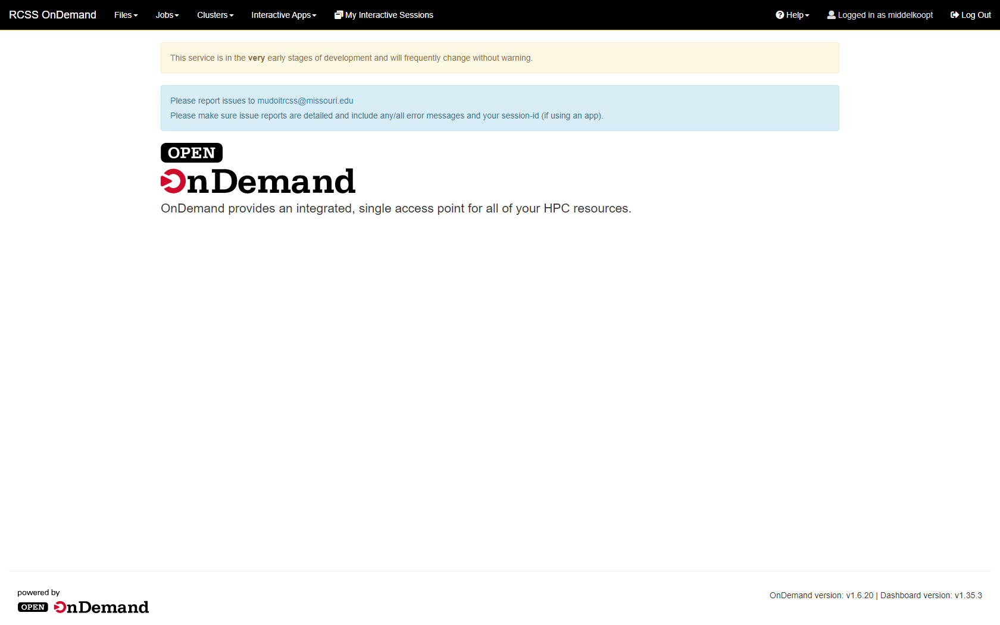

# IMSE 8410 Tools

*IMSE 8410 Advanced Computational Systems and Data Engineering*

Material Copyright 2017-2019 by Timothy Middelkoop. Source code
licensed under the Apache License, Version 2.0. Documentation licensed
under CC by SA 3.0.

## Tools

This class is approached from two directions.  Concepts and Tools.  It
takes a tool-first approach not because they are more important, they
are only a means to an end, but because the technical constraints,
prerequisites, and the shear time it takes to absorb and use the tools
had to be carefully constructed.  The tools are used to apply concepts
and techniques.  We will always try to motivate and explain the "why"
of the tools but it takes active participation and thinking. The tools
are replaceable, the concepts and techniques endure.

### OnDemand

Navigate to https://ondemand.rnet.missouri.edu and Login.  `Click Interactive`.

`Click Jupyter Lab`

`Scroll Down`

`Change Settings: Include Bash Kernal, 2 Hours, 2 Cores, 2 GB`; `Click Launch`

Wait 20 or more minutes.

`Connect to Jupyter`

Jupyter Lab

### Clark (CLI)
`Clusters > _Clark Shell Access`

### Gitlab

### Canvas (Assignments)

### Authentication (Secure Shell Keys)

