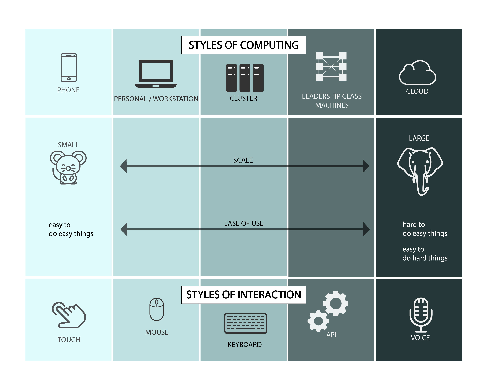
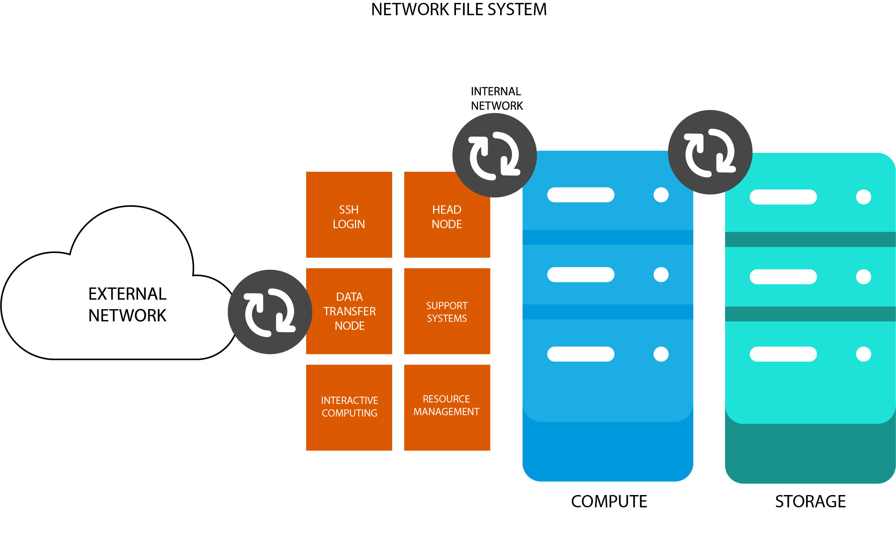

# IMSE 8410 Computing

*IMSE 8410 Advanced Computational Systems and Data Engineering*

Material Copyright 2017-2019 by Timothy Middelkoop. Source code
licensed under the Apache License, Version 2.0. Documentation licensed
under CC by SA 3.0.

## Computing

### Styles of Computation

### Basics of Computing

Research Computing (RC) systems are the **physical**,
**computational**, and **software**, infrastructure built by
**teams**, to manage **information**.

RC System need **physical** infrastructure consisting of
 * power, 
 * cooling,
 * and space,

to supports the fundamental **computational** resources 
 * compute,
 * storage, and
 * networking.

From these resources a **software** system is built through
 * provisioning (physical and logical), 
 * configuration,
 * software (Operating System, libraries, applications), and
 * security.

This infrastructure is used to **manage information** (data) through 
 * scientific processes (workflows),
 * data,
 * policy, and
 * security.

All this is all brought together by **teams** with 
 * people,
 * process, and
 * community.

** Security a fundamental property of systems and applications.

### High Performance Computing Clusters

## Reading
 * "High Performance Computing: Modern Systems and Practices" (Chapter 2, HPC Architecture 1; Chapter 3, Commodity Clusters )

## Discussion and Discovery
 * Flynn’s Taxonomy
 * Moore’s Law
 * Amdahl's Law
 * Memory Hierarchies
